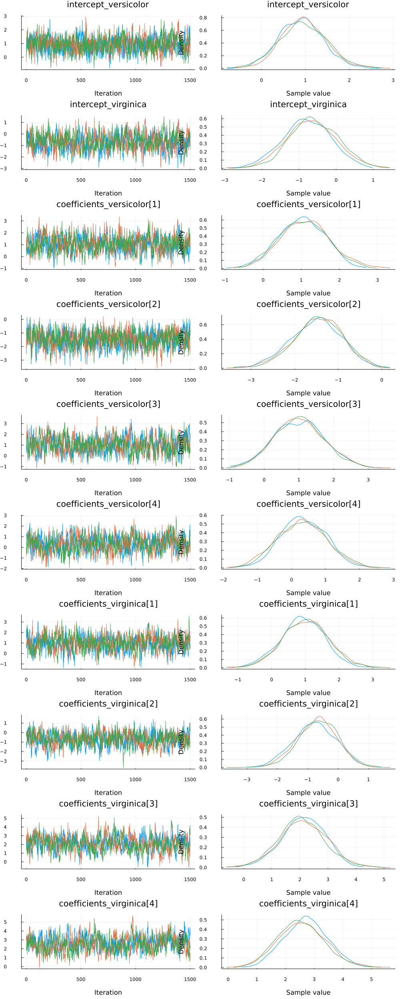
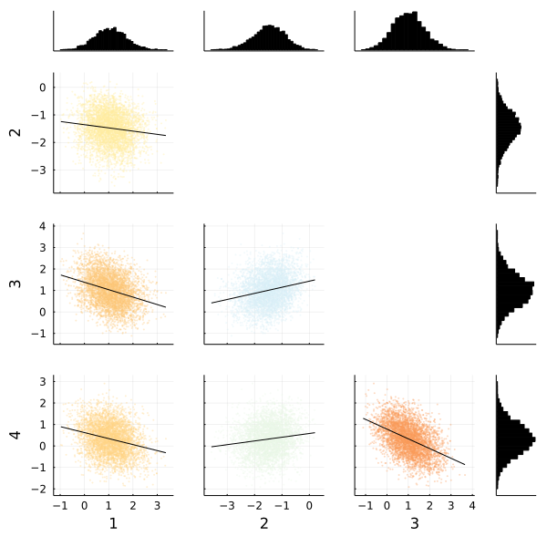
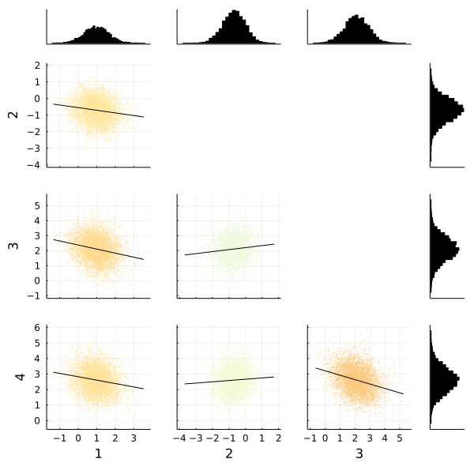

[Multinomial logistic regression](https://en.wikipedia.org/wiki/Multinomial_logistic_regression) is an extension of logistic regression. Logistic regression is used to model problems in which there are exactly two possible discrete outcomes. Multinomial logistic regression is used to model problems in which there are two or more possible discrete outcomes.

In our example, we'll be using the iris dataset. The goal of the iris multiclass problem is to predict the species of a flower given measurements (in centimeters) of sepal length and width and petal length and width. There are three possible species: Iris setosa, Iris versicolor, and Iris virginica.

To start, let's import all the libraries we'll need.


```julia
# Load Turing.
using Turing

# Load RDatasets.
using RDatasets

# Load StatsPlots for visualizations and diagnostics.
using StatsPlots

# Functionality for splitting and normalizing the data.
using MLDataUtils: shuffleobs, splitobs, rescale!

# We need a softmax function which is provided by NNlib.
using NNlib: softmax

# Set a seed for reproducibility.
using Random
Random.seed!(0)

# Hide the progress prompt while sampling.
Turing.setprogress!(false);
```


## Data Cleaning & Set Up

Now we're going to import our dataset. Twenty rows of the dataset are shown below so you can get a good feel for what kind of data we have.

```julia
# Import the "iris" dataset.
data = RDatasets.dataset("datasets", "iris");

# Show twenty random rows.
data[rand(1:size(data, 1), 20), :]
```

```
20×5 DataFrame
 Row │ SepalLength  SepalWidth  PetalLength  PetalWidth  Species
     │ Float64      Float64     Float64      Float64     Cat…
─────┼──────────────────────────────────────────────────────────────
   1 │         5.9         3.2          4.8         1.8  versicolor
   2 │         7.7         3.8          6.7         2.2  virginica
   3 │         5.9         3.0          4.2         1.5  versicolor
   4 │         6.3         2.9          5.6         1.8  virginica
   5 │         6.3         2.7          4.9         1.8  virginica
   6 │         4.8         3.4          1.6         0.2  setosa
   7 │         6.5         3.0          5.5         1.8  virginica
   8 │         5.0         3.4          1.5         0.2  setosa
  ⋮  │      ⋮           ⋮            ⋮           ⋮           ⋮
  14 │         5.6         2.8          4.9         2.0  virginica
  15 │         6.4         2.8          5.6         2.1  virginica
  16 │         7.2         3.6          6.1         2.5  virginica
  17 │         5.6         2.5          3.9         1.1  versicolor
  18 │         5.8         2.8          5.1         2.4  virginica
  19 │         5.8         2.7          4.1         1.0  versicolor
  20 │         5.0         3.4          1.5         0.2  setosa
                                                      5 rows omitted
```


In this data set, the outcome `Species` is currently coded as a string. We convert it to a numerical value by using indices `1`, `2`, and `3` to indicate species `setosa`, `versicolor`, and `virginica`, respectively.

```julia
# Recode the `Species` column.
species = ["setosa", "versicolor", "virginica"]
data[!, :Species_index] = indexin(data[!, :Species], species)

# Show twenty random rows of the new species columns
data[rand(1:size(data, 1), 20), [:Species, :Species_index]]
```

```
20×2 DataFrame
 Row │ Species     Species_index
     │ Cat…        Union…
─────┼───────────────────────────
   1 │ setosa      1
   2 │ virginica   3
   3 │ setosa      1
   4 │ versicolor  2
   5 │ setosa      1
   6 │ versicolor  2
   7 │ versicolor  2
   8 │ setosa      1
  ⋮  │     ⋮             ⋮
  14 │ setosa      1
  15 │ virginica   3
  16 │ virginica   3
  17 │ setosa      1
  18 │ versicolor  2
  19 │ virginica   3
  20 │ versicolor  2
                   5 rows omitted
```


After we've done that tidying, it's time to split our dataset into training and testing sets, and separate the features and target from the data. Additionally, we must rescale our feature variables so that they are centered around zero by subtracting each column by the mean and dividing it by the standard deviation. Without this step, Turing's sampler will have a hard time finding a place to start searching for parameter estimates.


```julia
# Split our dataset 50%/50% into training/test sets.
trainset, testset = splitobs(shuffleobs(data), 0.5)

# Define features and target.
features = [:SepalLength, :SepalWidth, :PetalLength, :PetalWidth]
target = :Species_index

# Turing requires data in matrix and vector form.
train_features = Matrix(trainset[!, features])
test_features = Matrix(testset[!, features])
train_target = trainset[!, target]
test_target = testset[!, target]

# Standardize the features.
μ, σ = rescale!(train_features; obsdim = 1)
rescale!(test_features, μ, σ; obsdim = 1);
```


## Model Declaration

Finally, we can define our model `logistic_regression`. It is a function that takes three arguments where

- `x` is our set of independent variables;
- `y` is the element we want to predict;
- `σ` is the standard deviation we want to assume for our priors.

We select the `setosa` species as the baseline class (the choice does not matter). Then we create the intercepts and vectors of coefficients for the other classes against that baseline. More concretely, we create scalar intercepts `intercept_versicolor` and `intersept_virginica` and coefficient vectors `coefficients_versicolor` and `coefficients_virginica` with four coefficients each for the features `SepalLength`, `SepalWidth`, `PetalLength` and `PetalWidth`. We assume a normal distribution with mean zero and standard deviation `σ` as prior for each scalar parameter. We want to find the posterior distribution of these, in total ten, parameters to be able to predict the species for any given set of features.


```julia
# Bayesian multinomial logistic regression
@model function logistic_regression(x, y, σ)
    n = size(x, 1)
    length(y) == n || throw(DimensionMismatch("number of observations in `x` and `y` is not equal"))

    # Priors of intercepts and coefficients.
    intercept_versicolor ~ Normal(0, σ)
    intercept_virginica ~ Normal(0, σ)
    coefficients_versicolor ~ MvNormal(4, σ)
    coefficients_virginica ~ MvNormal(4, σ)

    # Compute the likelihood of the observations.
    values_versicolor = intercept_versicolor .+ x * coefficients_versicolor
    values_virginica = intercept_virginica .+ x * coefficients_virginica
    for i in 1:n
        # the 0 corresponds to the base category `setosa`
        v = softmax([0, values_versicolor[i], values_virginica[i]])
        y[i] ~ Categorical(v)
    end
end;
```


## Sampling

Now we can run our sampler. This time we'll use [`HMC`](http://turing.ml/docs/library/#Turing.HMC) to sample from our posterior.


```julia
m = logistic_regression(train_features, train_target, 1)
chain = sample(m, HMC(0.05, 10), MCMCThreads(), 1_500, 3)
```

```
Chains MCMC chain (1500×19×3 Array{Float64, 3}):

Iterations        = 1:1:1500
Number of chains  = 3
Samples per chain = 1500
Wall duration     = 18.17 seconds
Compute duration  = 30.59 seconds
parameters        = coefficients_versicolor[3], coefficients_virginica[1], 
coefficients_versicolor[2], coefficients_virginica[3], intercept_versicolor
, coefficients_virginica[4], coefficients_versicolor[4], coefficients_versi
color[1], coefficients_virginica[2], intercept_virginica
internals         = lp, n_steps, is_accept, acceptance_rate, log_density, h
amiltonian_energy, hamiltonian_energy_error, step_size, nom_step_size

Summary Statistics
                  parameters      mean       std   naive_se      mcse      
  e ⋯
                      Symbol   Float64   Float64    Float64   Float64    Fl
oat ⋯

        intercept_versicolor    0.9354    0.5238     0.0078    0.0226   542
.78 ⋯
         intercept_virginica   -0.6837    0.6685     0.0100    0.0283   481
.34 ⋯
  coefficients_versicolor[1]    1.0630    0.6406     0.0096    0.0277   497
.97 ⋯
  coefficients_versicolor[2]   -1.4800    0.5730     0.0085    0.0253   632
.34 ⋯
  coefficients_versicolor[3]    1.0131    0.7155     0.0107    0.0336   449
.34 ⋯
  coefficients_versicolor[4]    0.3243    0.7044     0.0105    0.0397   357
.08 ⋯
   coefficients_virginica[1]    0.9780    0.6766     0.0101    0.0279   512
.07 ⋯
   coefficients_virginica[2]   -0.7076    0.6770     0.0101    0.0297   520
.45 ⋯
   coefficients_virginica[3]    2.1067    0.8158     0.0122    0.0415   388
.54 ⋯
   coefficients_virginica[4]    2.6082    0.7995     0.0119    0.0487   255
.90 ⋯
                                                               3 columns om
itted

Quantiles
                  parameters      2.5%     25.0%     50.0%     75.0%     97
.5% ⋯
                      Symbol   Float64   Float64   Float64   Float64   Floa
t64 ⋯

        intercept_versicolor   -0.0782    0.5827    0.9308    1.2831    1.9
832 ⋯
         intercept_virginica   -2.0133   -1.1248   -0.6926   -0.2305    0.6
289 ⋯
  coefficients_versicolor[1]   -0.1748    0.6246    1.0593    1.4983    2.3
599 ⋯
  coefficients_versicolor[2]   -2.6648   -1.8507   -1.4605   -1.0870   -0.4
017 ⋯
  coefficients_versicolor[3]   -0.3586    0.5081    1.0048    1.4892    2.4
542 ⋯
  coefficients_versicolor[4]   -1.0370   -0.1608    0.3164    0.8088    1.7
027 ⋯
   coefficients_virginica[1]   -0.3566    0.5259    0.9830    1.4316    2.2
932 ⋯
   coefficients_virginica[2]   -2.0652   -1.1573   -0.6868   -0.2362    0.5
693 ⋯
   coefficients_virginica[3]    0.4721    1.5736    2.1018    2.6520    3.6
780 ⋯
   coefficients_virginica[4]    1.1115    2.0559    2.6021    3.1349    4.2
297 ⋯
```


Since we ran multiple chains, we may as well do a spot check to make sure each chain converges around similar points.

```julia
plot(chain)
```




Looks good!

We can also use the `corner` function from MCMCChains to show the distributions of the various parameters of our multinomial logistic regression. The corner function requires MCMCChains and StatsPlots.

```julia
corner(
    chain, MCMCChains.namesingroup(chain, :coefficients_versicolor);
    label=[string(i) for i in 1:4]
)
```



```julia
corner(
    chain, MCMCChains.namesingroup(chain, :coefficients_virginica);
    label=[string(i) for i in 1:4]
)
```




Fortunately the corner plots appear to demonstrate unimodal distributions for each of our parameters, so it should be straightforward to take the means of each parameter's sampled values to estimate our model to make predictions.

## Making Predictions

How do we test how well the model actually predicts whether someone is likely to default? We need to build a `prediction` function that takes the test dataset and runs it through the average parameter calculated during sampling.

The `prediction` function below takes a `Matrix` and a `Chains` object. It computes the mean of the sampled parameters and calculates the species with the highest probability for each observation. Note that we do not have to evaluate the `softmax` function since it does not affect the order of its inputs.


```julia
function prediction(x::Matrix, chain)
    # Pull the means from each parameter's sampled values in the chain.
    intercept_versicolor = mean(chain, :intercept_versicolor)
    intercept_virginica = mean(chain, :intercept_virginica)
    coefficients_versicolor = [
        mean(chain, k) for k in
        MCMCChains.namesingroup(chain, :coefficients_versicolor)
    ]
    coefficients_virginica = [
        mean(chain, k) for k in
        MCMCChains.namesingroup(chain, :coefficients_virginica)
    ]

    # Compute the index of the species with the highest probability for each observation.
    values_versicolor = intercept_versicolor .+ x * coefficients_versicolor
    values_virginica = intercept_virginica .+ x * coefficients_virginica
    species_indices = [argmax((0, x, y)) for (x, y) in zip(values_versicolor, values_virginica)]
    
    return species_indices
end;
```


Let's see how we did! We run the test matrix through the prediction function, and compute the accuracy for our prediction.


```julia
# Make the predictions.
predictions = prediction(test_features, chain)

# Calculate accuracy for our test set.
mean(predictions .== testset[!, :Species_index])
```

```
0.92
```


Perhaps more important is to see the accuracy per class.

```julia
for s in 1:3
    rows = testset[!, :Species_index] .== s
    println("Number of `", species[s], "`: ", count(rows))
    println("Percentage of `", species[s], "` predicted correctly: ",
        mean(predictions[rows] .== testset[rows, :Species_index]))
end
```

```
Number of `setosa`: 24
Percentage of `setosa` predicted correctly: 0.9583333333333334
Number of `versicolor`: 25
Percentage of `versicolor` predicted correctly: 0.88
Number of `virginica`: 26
Percentage of `virginica` predicted correctly: 0.9230769230769231
```


This tutorial has demonstrated how to use Turing to perform Bayesian multinomial logistic regression. 


## Appendix
 This tutorial is part of the TuringTutorials repository, found at: <https://github.com/TuringLang/TuringTutorials>.

To locally run this tutorial, do the following commands:
```julia, eval = false
using TuringTutorials
TuringTutorials.weave_file("08-multinomial-logistic-regression", "08_multinomial-logistic-regression.jmd")
```

Computer Information:
```
Julia Version 1.6.2
Commit 1b93d53fc4 (2021-07-14 15:36 UTC)
Platform Info:
  OS: Linux (x86_64-pc-linux-gnu)
  CPU: Intel(R) Xeon(R) Platinum 8272CL CPU @ 2.60GHz
  WORD_SIZE: 64
  LIBM: libopenlibm
  LLVM: libLLVM-11.0.1 (ORCJIT, skylake-avx512)
Environment:
  JULIA_NUM_THREADS = 2

```

Package Information:

```
      Status `~/work/TuringTutorials/TuringTutorials/tutorials/08-multinomial-logistic-regression/Project.toml`
  [a93c6f00] DataFrames v1.2.0
  [b4f34e82] Distances v0.10.3
  [31c24e10] Distributions v0.25.11
  [38e38edf] GLM v1.5.1
  [c7f686f2] MCMCChains v4.13.1
  [cc2ba9b6] MLDataUtils v0.5.4
  [872c559c] NNlib v0.7.25
  [91a5bcdd] Plots v1.19.2
  [ce6b1742] RDatasets v0.7.5
  [4c63d2b9] StatsFuns v0.9.8
  [f3b207a7] StatsPlots v0.14.25
  [fce5fe82] Turing v0.16.6
  [9a3f8284] Random

```
