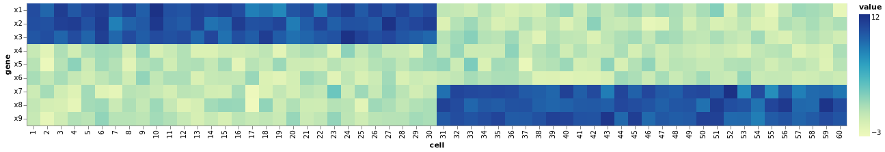
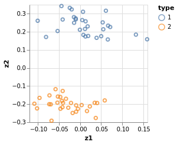
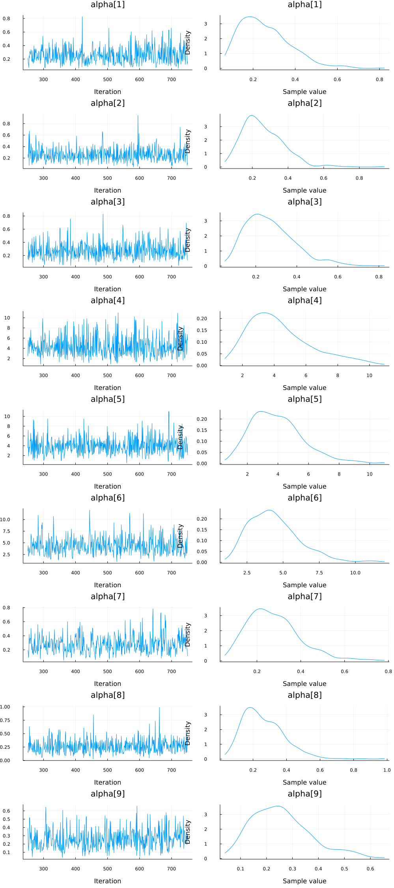
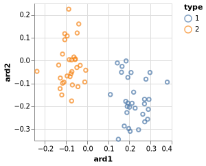
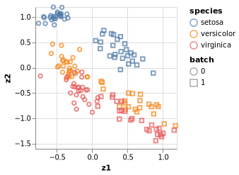
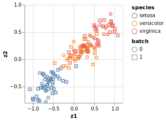

Principal component analysis is a fundamental technique to analyse and visualise data.
You will have come across it in many forms and names.
Here, we give a probabilistic perspective on PCA with some biologically motivated examples.
For more details and a mathematical derivation, we recommend Bishop's textbook (Christopher M. Bishop, Pattern Recognition and Machine Learning, 2006)

```julia
using Turing
using Distributions, LinearAlgebra

# Packages for visualization
using VegaLite, DataFrames, StatsPlots

# Import Fisher's iris example data set
using RDatasets

# Set a seed for reproducibility.
using Random
Random.seed!(1789);

Threads.nthreads()
n_chains=1
```

```
1
```


## A basic PCA example

### Simulate data

We'll generate synthetic data to explore the models. The simulation is inspired by biological measurement of
expression of genes in cells, and so you can think of the two dimensions as cells and genes.
Admittedly, this is a very simplistic example.
Real life is much more messy.

```julia
n_cells = 60
n_genes = 9
mu_1 = 10. * ones(n_genes÷3)
mu_0 = zeros(n_genes÷3)
S = I(n_genes÷3)
mvn_0 = MvNormal(mu_0, S)
mvn_1 = MvNormal(mu_1, S)

# create a diagonal block like expression matrix, with some non-informative cells
expression_matrix = transpose(vcat(hcat(rand(mvn_1, n_cells÷2), rand(mvn_0, n_cells÷2)),
                                   hcat(rand(mvn_0, n_cells÷2), rand(mvn_0, n_cells÷2)),
                                   hcat(rand(mvn_0, n_cells÷2), rand(mvn_1, n_cells÷2))))


df_exp = DataFrame(expression_matrix, :auto)
df_exp[!,:cell] = 1:n_cells

DataFrames.stack(df_exp, 1:n_genes) |>
    @vlplot(:rect, x="cell:o", color=:value, encoding={y={field="variable", type="nominal", sort="-x",
    axis={title="gene"}}})
```




### pPCA model

The idea of pPCA is to find a latent variable $z$ that can be used to describe
hidden structure in our dataset.
We use a simple Gaussian prior for
$$
P(z) = \mathcal{N}(z | 0, I)
$$
and similarly, the conditional distribution
$$
P(x | z) = \mathcal{N}(x | W z + \mu, \sigma^2 I)
$$
is modeled via a Gaussian distribution.

```julia
@model pPCA(x, ::Type{T} = Float64) where {T} = begin

  # Dimensionality of the problem.
  N, D = size(x)

  # latent variable z
  z = Matrix{T}(undef, D, N)
  for n in 1:N
    z[:, n] ~ MvNormal(D, 1.)
  end

  # weights/loadings W
  w = Matrix{T}(undef, D, D)
  for d in 1:D
    w[d, :] ~ MvNormal(D, 1.)
  end

  # mean offset
  mean = Vector{T}(undef, D)
  mean ~ MvNormal(D, 1.0)
  mu = w * z .+ mean

  for d in 1:D
    x[:,d] ~ MvNormal(mu[d,:], 1.)
  end

end
```

```
pPCA (generic function with 2 methods)
```


### pPCA inference

It is important to note that although the maximum likelihood estimates of W,\mu in the pPCA model correspond to the PCA subspace,
only posterior distributions can be obtained for the latent data (points on the subspace).
Neither the mode nor the mean of those distributions corresponds to the PCA points (orthogonal projections of the observations onto the subspace).
However what is true, is that the posterior distributions converge to the PCA points as \sigma^2 \rightarrow 0.

```julia
ppca = pPCA(expression_matrix)
n_iterations = 300
chain = sample(ppca, NUTS(), MCMCThreads(), n_iterations, n_chains);

# TODO how to inspect large models?
```


### pPCA sanity check

A quick sanity check.
We try to reconstruct the input data from our parameter estimates.


```julia
# Extract paramter estimates for plotting - mean of posterior
w = permutedims(reshape(mean(group(chain, :w))[:,2], (n_genes, n_genes)))
z = permutedims(reshape(mean(group(chain, :z))[:,2], (n_genes, n_cells)))'
mu = mean(group(chain, :mean))[:,2]

X = w * z .+ mu
X = w * z

df_rec = DataFrame(X', :auto)
df_rec[!,:cell] = 1:n_cells

DataFrames.stack(df_rec, 1:n_genes) |>
    @vlplot(:rect, x="cell:o", color=:value, encoding={y={field="variable", type="nominal", sort="-x",
    axis={title="gene"}}})
```


And finally, we plot the data in a lower dimensional space
```julia
df_pca = DataFrame(z')
rename!(df_pca, Symbol.( ["z"*string(i) for i in collect(1:n_genes)]))
df_pca[!,:cell] = 1:n_cells

DataFrames.stack(df_pca, 1:n_genes) |> @vlplot(:rect, "cell:o", "variable:o", color=:value)

df_pca[!,:type] = repeat([1, 2], inner = n_cells÷2)
df_pca |>  @vlplot(:point, x=:z1, y=:z2, color="type:n")
```




## Number of components

A common question arising in latent factor models is the choice of components,
i.e. how many dimensions are needed to represent that data in the latent space.
In the case of PCA, there exist a lot of heuristics to make that choice.
By using the pPCA model, this can be accomplished very elegantly, with a technique called *Automatic-Relevance-Determination*.
Essentially, we are using a specific prior over W that allows us to prune away dimensions in the
latent space. The prior is determined by a precision hyperparameter $\alpha$. Here, smaller values of $\alpha$ correspond to more important components.
You can find more details about this in the Bishop book mentioned in the introduction.


```julia
@model pPCA_ARD(x, ::Type{T} = Float64) where {T} = begin

  # Dimensionality of the problem.
  N, D = size(x)

  # latent variable z
  z = Matrix{T}(undef, D, N)
  for n in 1:N
    z[:, n] ~ MvNormal(D, 1.)
  end

  # weights/loadings w with Automatic Relevance Determination part
  alpha = Vector{T}(undef, D)
  for d in 1:D
    alpha[d] ~ Gamma(1., 1.)
  end

  w = Matrix{T}(undef, D, D)
  for d in 1:D
    w[d, :] ~ MvNormal(zeros(D), 1. ./ sqrt.(alpha))
  end

  # it is possible to specify a mean offset here
  #  mean = Vector{T}(undef, D)
  #  mean ~ MvNormal(D, 1.0)
  mu = w * z #.+ mean

  tau ~ Gamma(1.0, 1.0);
  for d in 1:D
    x[:,d] ~ MvNormal(mu[d,:], 1. / sqrt(tau))
  end

end
```

```
pPCA_ARD (generic function with 2 methods)
```


```julia
ppca_ARD = pPCA_ARD(expression_matrix)
n_iterations = 400
chain = sample(ppca_ARD, NUTS(), MCMCThreads(), n_iterations, n_chains)

StatsPlots.plot(group(chain, :alpha))
```



```julia
# Extract paramter estimates for plotting - mean of posterior
w = permutedims(reshape(mean(group(chain, :w))[:,2], (n_genes,n_genes)))
z = permutedims(reshape(mean(group(chain, :z))[:,2], (n_genes, n_cells)))'
α = mean(group(chain, :alpha))[:,2]
α
```

```
9-element Vector{Float64}:
 3.447150319289705
 0.07532134194323332
 0.07754397424990225
 3.6029909065586874
 3.4102919134808274
 3.4895349964035596
 3.380911472677809
 3.507756238668494
 3.5031739081430793
```


We can inspect alpha to see which elements are small, i.e. have a high relevance.

```julia
alpha_indices = sortperm(α)[1:2]
X = w[alpha_indices, alpha_indices] * z[alpha_indices,:]

df_rec = DataFrame(X', :auto)
df_rec[!,:cell] = 1:n_cells

#  #  DataFrames.stack(df_rec, 1:n_genes) |> @vlplot(:rect, "cell:o", "variable:o", color=:value) |> save("reconstruction.pdf")
DataFrames.stack(df_rec, 1:2) |> @vlplot(:rect, "cell:o", "variable:o", color=:value)

df_pre = DataFrame(z')
rename!(df_pre, Symbol.( ["z"*string(i) for i in collect(1:n_genes)]))
df_pre[!,:cell] = 1:n_cells

DataFrames.stack(df_pre, 1:n_genes) |> @vlplot(:rect, "cell:o", "variable:o", color=:value)

df_pre[!,:type] = repeat([1, 2], inner = n_cells÷2)
df_pre[!,:ard1] = df_pre[:, alpha_indices[1]]
df_pre[!,:ard2] = df_pre[:, alpha_indices[2]]
df_pre |>  @vlplot(:point, x=:ard1, y=:ard2, color="type:n")
```




## Batch effects

Finally, a very common issue to address in biological data is [batch effects](https://en.wikipedia.org/wiki/Batch_effec).
A batch effect occurs when non-biological factors in an experiment cause changes in the data produced by the experiment.
As an example, we will look at Fisher's famous Iris data set.

The data set consists of 50 samples each from three species of Iris (Iris setosa, Iris virginica and Iris versicolor).
Four features were measured from each sample: the length and the width of the sepals and petals, in centimeters.

```julia
# Example data set - generate synthetic gene expression data
using RDatasets
data = dataset("datasets", "iris")
species = data[!, "Species"]
dat = data[!, 1:4]
n, d = size(dat)
```

```
(150, 4)
```


```julia
ppca = pPCA(dat)

# Here we use a different samples, we don't always have to use NUTS:
# Hamiltonian Monte Carlo (HMC) sampler parameters
n_iterations = 500
ϵ = 0.05
τ = 10

chain = sample(ppca, HMC(ϵ, τ), n_iterations)

# Extract paramter estimates for plotting - mean of posterior
w = permutedims(reshape(mean(group(chain, :w))[:,2], (d,d)))
z = permutedims(reshape(mean(group(chain, :z))[:,2], (d, n)))'
mu = mean(group(chain, :mean))[:,2]

X = w * z
# X = w * z .+ mu

df_rec = DataFrame(X', :auto)
df_rec[!,:species] = species
DataFrames.stack(df_rec, 1:d) |> @vlplot(:rect, "species:o", "variable:o", color=:value)

df_iris = DataFrame(z', :auto)
rename!(df_iris, Symbol.( ["z"*string(i) for i in collect(1:d)]))
df_iris[!,:sample] = 1:n
df_iris[!,:species] = species

df_iris |>  @vlplot(:point, x=:z1, y=:z2, color="species:n")
```


We now simulate a batch effect; imagine the person taking the measurement uses two different rulers and they are slightly off.
Again, in practice there are many different reasons for why batch effects occur and it is not always clear what is really at the basis of them,
nor can they always be tackled via the experimental setup. So we need methods to deal with them.

```julia
## Introduce batch effect
batch = rand(Binomial(1, 0.5), 150)
effect = rand(Normal(2.4, 0.6), 150)
batch_dat = dat .+ batch .* effect

ppca_batch = pPCA(batch_dat)
chain = sample(ppca_batch, HMC(ϵ, τ), 500)
describe(chain)[1]

z = permutedims(reshape(mean(group(chain, :z))[:,2], (d, n)))'
df_pre = DataFrame(z')
rename!(df_pre, Symbol.( ["z"*string(i) for i in collect(1:d)]))
df_pre[!,:sample] = 1:n
df_pre[!,:species] = species
df_pre[!,:batch] = batch

df_pre |>  @vlplot(:point, x=:z1, y=:z2, color="species:n", shape=:batch)
```




In order to correct for the batch effect, we need to know about the assignment of measurement to batch.
In our example, this means knowing which ruler was used for which measurement.

```julia
@model pPCA_residual(x, batch, ::Type{T} = Float64) where {T} = begin

  # Dimensionality of the problem.
  N, D = size(x)

  # latent variable z
  z = Matrix{T}(undef, D, N)
  for n in 1:N
    z[:, n] ~ MvNormal(D, 1.)
  end

  # weights/loadings w
  w = Matrix{T}(undef, D, D)
  for d in 1:D
    w[d, :] ~ MvNormal(D, 1.)
  end

  # covariate vector
  w_batch = Vector{T}(undef, D)
  w_batch ~ MvNormal(D, 1.)

  # mean offset
  mean = Vector{T}(undef, D)
  mean ~ MvNormal(D, 1.0)
  mu = w * z .+ mean + w_batch .* batch'

  for d in 1:D
    x[:,d] ~ MvNormal(mu[d,:], 1.)
  end

end

ppca_residual = pPCA_residual(batch_dat, convert(Vector{Float64}, batch))
chain = sample(ppca_residual, HMC(ϵ, τ), 1000)
```

```
Chains MCMC chain (1000×633×1 Array{Float64, 3}):

Iterations        = 1:1000
Thinning interval = 1
Number of chains  = 1
Samples per chain = 1000
Wall duration     = 238.55 seconds
Compute duration  = 238.55 seconds
parameters        = z[Colon(),16][2], z[Colon(),104][3], z[Colon(),90][1], 
z[Colon(),105][3], z[Colon(),42][4], z[Colon(),111][1], z[Colon(),58][4], z
[Colon(),21][1], z[Colon(),4][2], z[Colon(),100][2], z[Colon(),118][3], z[C
olon(),67][4], z[Colon(),1][4], z[Colon(),148][1], z[Colon(),133][4], z[Col
on(),131][4], z[Colon(),44][2], z[Colon(),22][3], z[Colon(),44][4], z[Colon
(),120][1], z[Colon(),18][1], z[Colon(),50][2], z[Colon(),23][3], z[Colon()
,58][1], z[Colon(),114][3], z[Colon(),38][2], z[Colon(),36][2], z[Colon(),1
14][1], z[Colon(),52][3], z[Colon(),145][3], w[4,Colon()][4], z[Colon(),73]
[3], z[Colon(),75][4], z[Colon(),26][2], z[Colon(),105][2], z[Colon(),27][2
], z[Colon(),77][2], z[Colon(),3][3], z[Colon(),30][4], z[Colon(),84][4], z
[Colon(),77][3], w[3,Colon()][4], z[Colon(),149][2], z[Colon(),112][4], z[C
olon(),18][4], z[Colon(),70][1], z[Colon(),50][4], z[Colon(),131][3], z[Col
on(),61][1], z[Colon(),33][4], z[Colon(),25][3], z[Colon(),113][1], z[Colon
(),128][4], z[Colon(),17][4], z[Colon(),13][3], z[Colon(),37][4], z[Colon()
,29][1], w[4,Colon()][1], w[4,Colon()][2], z[Colon(),148][3], z[Colon(),150
][2], z[Colon(),138][4], z[Colon(),115][1], z[Colon(),48][3], z[Colon(),26]
[3], z[Colon(),14][1], z[Colon(),119][4], z[Colon(),118][1], z[Colon(),9][3
], z[Colon(),24][1], z[Colon(),103][4], z[Colon(),121][2], z[Colon(),83][4]
, z[Colon(),141][3], z[Colon(),38][3], z[Colon(),131][2], z[Colon(),110][1]
, z[Colon(),129][1], z[Colon(),6][1], z[Colon(),108][4], z[Colon(),39][3], 
z[Colon(),87][1], z[Colon(),95][2], z[Colon(),16][1], z[Colon(),35][2], z[C
olon(),15][1], z[Colon(),61][2], z[Colon(),100][3], z[Colon(),127][2], z[Co
lon(),43][2], z[Colon(),76][3], z[Colon(),81][4], z[Colon(),149][1], z[Colo
n(),76][4], z[Colon(),13][1], w[2,Colon()][2], z[Colon(),19][4], z[Colon(),
140][1], z[Colon(),102][1], mean[2], z[Colon(),66][2], z[Colon(),29][2], z[
Colon(),117][2], z[Colon(),79][4], z[Colon(),135][4], z[Colon(),47][4], z[C
olon(),148][4], z[Colon(),104][1], z[Colon(),23][4], z[Colon(),7][1], z[Col
on(),107][2], z[Colon(),2][3], z[Colon(),16][4], z[Colon(),73][2], z[Colon(
),72][2], z[Colon(),17][2], z[Colon(),114][4], w[1,Colon()][4], z[Colon(),5
7][3], z[Colon(),81][3], z[Colon(),119][2], z[Colon(),82][4], z[Colon(),19]
[3], z[Colon(),35][4], z[Colon(),78][4], z[Colon(),135][3], z[Colon(),11][4
], z[Colon(),126][1], z[Colon(),101][3], z[Colon(),121][1], z[Colon(),77][1
], z[Colon(),82][2], z[Colon(),47][3], z[Colon(),59][3], z[Colon(),56][1], 
z[Colon(),32][1], z[Colon(),142][3], z[Colon(),2][2], z[Colon(),89][4], z[C
olon(),54][2], z[Colon(),27][3], w_batch[3], z[Colon(),111][4], z[Colon(),1
17][1], z[Colon(),98][1], z[Colon(),26][1], z[Colon(),51][4], z[Colon(),140
][4], z[Colon(),22][2], z[Colon(),147][3], z[Colon(),75][3], z[Colon(),19][
2], z[Colon(),74][3], w_batch[4], z[Colon(),25][1], z[Colon(),3][1], z[Colo
n(),20][1], z[Colon(),61][4], z[Colon(),120][3], z[Colon(),138][1], w[1,Col
on()][3], z[Colon(),60][4], z[Colon(),73][1], z[Colon(),31][2], z[Colon(),1
43][3], z[Colon(),103][2], z[Colon(),98][2], z[Colon(),133][1], z[Colon(),4
5][4], z[Colon(),34][4], z[Colon(),129][4], z[Colon(),30][1], z[Colon(),105
][4], z[Colon(),99][3], z[Colon(),80][1], z[Colon(),49][2], z[Colon(),125][
1], z[Colon(),115][2], z[Colon(),105][1], z[Colon(),108][1], z[Colon(),71][
1], z[Colon(),67][2], z[Colon(),52][4], z[Colon(),55][3], z[Colon(),121][3]
, w[3,Colon()][2], z[Colon(),20][2], z[Colon(),149][4], z[Colon(),125][3], 
z[Colon(),126][2], z[Colon(),106][1], z[Colon(),43][1], z[Colon(),21][4], z
[Colon(),74][2], w_batch[1], z[Colon(),7][3], z[Colon(),62][3], z[Colon(),8
9][3], z[Colon(),73][4], z[Colon(),31][1], z[Colon(),12][1], z[Colon(),115]
[3], z[Colon(),146][3], z[Colon(),144][1], z[Colon(),143][1], z[Colon(),28]
[1], z[Colon(),136][3], z[Colon(),116][3], z[Colon(),68][4], z[Colon(),76][
2], z[Colon(),124][4], z[Colon(),139][1], z[Colon(),47][1], z[Colon(),134][
1], z[Colon(),36][1], z[Colon(),55][4], z[Colon(),48][2], z[Colon(),30][3],
 z[Colon(),43][3], w[2,Colon()][1], z[Colon(),118][2], z[Colon(),92][4], z[
Colon(),132][4], z[Colon(),72][1], z[Colon(),1][2], z[Colon(),92][1], z[Col
on(),80][3], z[Colon(),32][2], z[Colon(),12][4], z[Colon(),104][4], z[Colon
(),68][1], z[Colon(),134][4], z[Colon(),135][1], z[Colon(),48][1], w[3,Colo
n()][3], z[Colon(),5][4], z[Colon(),13][4], z[Colon(),145][2], z[Colon(),12
0][2], z[Colon(),77][4], z[Colon(),135][2], z[Colon(),78][2], z[Colon(),4][
1], z[Colon(),6][3], z[Colon(),145][4], z[Colon(),72][4], w_batch[2], z[Col
on(),97][3], z[Colon(),96][4], z[Colon(),15][2], z[Colon(),57][4], z[Colon(
),128][1], z[Colon(),43][4], z[Colon(),122][3], z[Colon(),137][3], z[Colon(
),22][1], z[Colon(),60][2], z[Colon(),99][2], z[Colon(),107][4], z[Colon(),
108][2], z[Colon(),124][1], z[Colon(),94][1], z[Colon(),91][3], z[Colon(),3
8][4], z[Colon(),150][3], z[Colon(),143][4], z[Colon(),75][1], z[Colon(),96
][2], z[Colon(),38][1], z[Colon(),80][4], z[Colon(),14][4], z[Colon(),97][1
], z[Colon(),14][2], z[Colon(),84][3], z[Colon(),9][1], z[Colon(),61][3], z
[Colon(),11][2], z[Colon(),94][4], z[Colon(),56][3], z[Colon(),47][2], z[Co
lon(),146][4], z[Colon(),112][2], w[1,Colon()][2], z[Colon(),8][4], z[Colon
(),40][3], z[Colon(),59][1], z[Colon(),127][4], z[Colon(),86][3], z[Colon()
,146][1], z[Colon(),46][4], z[Colon(),80][2], z[Colon(),54][3], z[Colon(),1
04][2], z[Colon(),78][3], z[Colon(),128][2], z[Colon(),126][3], z[Colon(),3
3][3], z[Colon(),130][3], z[Colon(),30][2], z[Colon(),106][4], z[Colon(),13
9][3], z[Colon(),8][3], z[Colon(),132][2], mean[4], z[Colon(),123][4], z[Co
lon(),15][3], z[Colon(),90][4], z[Colon(),60][1], z[Colon(),63][4], z[Colon
(),62][4], z[Colon(),6][4], z[Colon(),32][4], z[Colon(),116][4], z[Colon(),
46][3], z[Colon(),89][1], z[Colon(),125][2], z[Colon(),137][4], z[Colon(),2
3][1], z[Colon(),74][4], z[Colon(),113][4], z[Colon(),127][3], z[Colon(),79
][3], z[Colon(),132][3], z[Colon(),51][2], z[Colon(),130][1], z[Colon(),144
][4], z[Colon(),101][4], z[Colon(),67][3], z[Colon(),86][2], z[Colon(),3][4
], z[Colon(),114][2], z[Colon(),24][4], z[Colon(),94][3], z[Colon(),54][1],
 z[Colon(),8][1], z[Colon(),62][1], z[Colon(),52][1], z[Colon(),42][3], z[C
olon(),117][4], z[Colon(),91][1], z[Colon(),27][4], z[Colon(),12][2], z[Col
on(),92][3], z[Colon(),70][4], z[Colon(),83][3], z[Colon(),146][2], z[Colon
(),55][1], z[Colon(),37][2], z[Colon(),21][3], z[Colon(),45][3], z[Colon(),
65][3], z[Colon(),141][4], z[Colon(),121][4], z[Colon(),2][1], z[Colon(),10
9][2], z[Colon(),144][3], z[Colon(),49][4], z[Colon(),8][2], z[Colon(),4][4
], z[Colon(),36][3], z[Colon(),90][3], z[Colon(),66][3], z[Colon(),35][1], 
z[Colon(),31][3], z[Colon(),34][3], z[Colon(),87][2], z[Colon(),11][1], z[C
olon(),81][1], z[Colon(),2][4], z[Colon(),57][1], z[Colon(),113][2], z[Colo
n(),123][2], z[Colon(),147][2], z[Colon(),37][1], z[Colon(),53][4], z[Colon
(),46][1], z[Colon(),9][4], z[Colon(),108][3], z[Colon(),127][1], z[Colon()
,44][3], z[Colon(),53][2], z[Colon(),10][4], z[Colon(),51][1], z[Colon(),93
][3], z[Colon(),130][4], z[Colon(),124][3], z[Colon(),5][2], z[Colon(),100]
[1], z[Colon(),54][4], z[Colon(),59][2], z[Colon(),53][1], z[Colon(),18][3]
, z[Colon(),42][1], z[Colon(),100][4], z[Colon(),15][4], z[Colon(),138][2],
 z[Colon(),29][3], z[Colon(),88][1], z[Colon(),101][2], w[2,Colon()][3], z[
Colon(),87][3], z[Colon(),84][2], z[Colon(),20][3], z[Colon(),83][2], z[Col
on(),141][2], z[Colon(),41][2], z[Colon(),68][3], z[Colon(),20][4], z[Colon
(),148][2], z[Colon(),118][4], z[Colon(),130][2], z[Colon(),98][3], z[Colon
(),111][2], z[Colon(),63][3], z[Colon(),82][1], z[Colon(),119][3], z[Colon(
),1][1], z[Colon(),5][3], z[Colon(),41][1], z[Colon(),116][1], z[Colon(),10
9][1], z[Colon(),125][4], z[Colon(),86][4], z[Colon(),129][3], z[Colon(),6]
[2], z[Colon(),102][3], z[Colon(),78][1], z[Colon(),110][4], z[Colon(),107]
[1], z[Colon(),56][2], z[Colon(),144][2], z[Colon(),71][3], z[Colon(),123][
3], z[Colon(),107][3], z[Colon(),106][3], z[Colon(),10][3], z[Colon(),27][1
], z[Colon(),112][3], w[1,Colon()][1], z[Colon(),137][1], z[Colon(),26][4],
 w[2,Colon()][4], z[Colon(),37][3], z[Colon(),17][3], z[Colon(),133][3], z[
Colon(),75][2], z[Colon(),33][1], z[Colon(),86][1], z[Colon(),88][3], z[Col
on(),46][2], z[Colon(),9][2], z[Colon(),69][3], z[Colon(),14][3], z[Colon()
,110][2], z[Colon(),142][1], z[Colon(),60][3], z[Colon(),45][2], z[Colon(),
50][1], z[Colon(),55][2], z[Colon(),59][4], z[Colon(),149][3], z[Colon(),11
5][4], z[Colon(),122][2], z[Colon(),136][1], z[Colon(),88][2], z[Colon(),14
1][1], z[Colon(),88][4], z[Colon(),44][1], z[Colon(),64][1], z[Colon(),67][
1], z[Colon(),81][2], z[Colon(),131][1], z[Colon(),64][2], z[Colon(),65][1]
, z[Colon(),29][4], z[Colon(),74][1], z[Colon(),97][2], z[Colon(),123][1], 
z[Colon(),82][3], z[Colon(),66][4], z[Colon(),122][4], z[Colon(),137][2], z
[Colon(),103][1], z[Colon(),64][4], z[Colon(),136][4], z[Colon(),24][3], z[
Colon(),113][3], z[Colon(),62][2], z[Colon(),39][4], z[Colon(),21][2], z[Co
lon(),3][2], z[Colon(),96][3], z[Colon(),133][2], z[Colon(),136][2], z[Colo
n(),53][3], z[Colon(),117][3], z[Colon(),95][3], z[Colon(),109][3], z[Colon
(),95][1], z[Colon(),85][1], z[Colon(),147][4], z[Colon(),79][2], z[Colon()
,66][1], z[Colon(),70][3], z[Colon(),111][3], z[Colon(),40][2], z[Colon(),1
34][3], z[Colon(),142][4], z[Colon(),12][3], z[Colon(),35][3], z[Colon(),72
][3], z[Colon(),99][1], z[Colon(),10][1], z[Colon(),126][4], z[Colon(),99][
4], z[Colon(),33][2], z[Colon(),48][4], mean[3], z[Colon(),120][4], z[Colon
(),124][2], z[Colon(),150][1], z[Colon(),1][3], z[Colon(),140][2], z[Colon(
),45][1], z[Colon(),50][3], z[Colon(),41][3], z[Colon(),13][2], z[Colon(),1
02][4], z[Colon(),119][1], z[Colon(),134][2], z[Colon(),68][2], z[Colon(),1
02][2], z[Colon(),142][2], z[Colon(),85][4], z[Colon(),69][2], z[Colon(),93
][4], z[Colon(),25][4], z[Colon(),89][2], z[Colon(),129][2], z[Colon(),97][
4], z[Colon(),49][1], z[Colon(),94][2], z[Colon(),57][2], z[Colon(),138][3]
, z[Colon(),91][4], z[Colon(),24][2], z[Colon(),63][2], z[Colon(),31][4], z
[Colon(),95][4], z[Colon(),65][2], z[Colon(),18][2], z[Colon(),41][4], z[Co
lon(),16][3], z[Colon(),17][1], z[Colon(),91][2], z[Colon(),112][1], z[Colo
n(),85][3], z[Colon(),92][2], z[Colon(),90][2], z[Colon(),110][3], z[Colon(
),93][1], z[Colon(),5][1], z[Colon(),4][3], z[Colon(),101][1], z[Colon(),12
2][1], z[Colon(),58][2], z[Colon(),85][2], z[Colon(),103][3], z[Colon(),140
][3], z[Colon(),10][2], z[Colon(),52][2], z[Colon(),132][1], z[Colon(),79][
1], z[Colon(),7][4], z[Colon(),109][4], z[Colon(),22][4], z[Colon(),40][1],
 z[Colon(),58][3], z[Colon(),11][3], z[Colon(),69][4], z[Colon(),69][1], z[
Colon(),76][1], z[Colon(),49][3], z[Colon(),71][2], z[Colon(),139][2], z[Co
lon(),28][3], z[Colon(),65][4], z[Colon(),139][4], z[Colon(),36][4], z[Colo
n(),147][1], z[Colon(),39][2], mean[1], z[Colon(),7][2], z[Colon(),98][4], 
z[Colon(),128][3], z[Colon(),63][1], w[4,Colon()][3], z[Colon(),28][2], z[C
olon(),19][1], z[Colon(),56][4], z[Colon(),83][1], w[3,Colon()][1], z[Colon
(),40][4], z[Colon(),116][2], z[Colon(),87][4], z[Colon(),64][3], z[Colon()
,25][2], z[Colon(),39][1], z[Colon(),28][4], z[Colon(),84][1], z[Colon(),14
3][2], z[Colon(),32][3], z[Colon(),71][4], z[Colon(),96][1], z[Colon(),42][
2], z[Colon(),23][2], z[Colon(),70][2], z[Colon(),106][2], z[Colon(),51][3]
, z[Colon(),93][2], z[Colon(),145][1], z[Colon(),150][4], z[Colon(),34][2],
 z[Colon(),34][1]
internals         = lp, n_steps, is_accept, acceptance_rate, log_density, h
amiltonian_energy, hamiltonian_energy_error, step_size, nom_step_size

Summary Statistics
       parameters      mean       std   naive_se      mcse       ess      r
hat ⋯
           Symbol   Float64   Float64    Float64   Float64   Float64   Floa
t64 ⋯

  z[Colon(),1][1]   -0.5625    0.8298     0.0262    0.1556    8.9816    1.1
478 ⋯
  z[Colon(),1][2]   -0.4852    0.9879     0.0312    0.1030   57.1312    1.0
010 ⋯
  z[Colon(),1][3]   -0.3607    1.0060     0.0318    0.1732   19.6727    1.0
944 ⋯
  z[Colon(),1][4]    0.2814    1.0562     0.0334    0.1183   54.9115    0.9
996 ⋯
  z[Colon(),2][1]   -0.6064    0.8436     0.0267    0.1338   41.3553    1.0
239 ⋯
  z[Colon(),2][2]   -0.4135    0.9942     0.0314    0.1429   31.3643    1.0
034 ⋯
  z[Colon(),2][3]   -0.4744    0.9567     0.0303    0.1249   40.0143    1.0
642 ⋯
  z[Colon(),2][4]    0.4041    0.9549     0.0302    0.1290   66.3919    1.0
146 ⋯
  z[Colon(),3][1]   -0.5034    0.9576     0.0303    0.2164    4.6280    1.2
888 ⋯
  z[Colon(),3][2]   -0.6568    0.9212     0.0291    0.1142   50.7055    1.0
168 ⋯
  z[Colon(),3][3]   -0.4428    0.9899     0.0313    0.1801   12.7066    1.1
192 ⋯
  z[Colon(),3][4]    0.3164    0.8876     0.0281    0.0908   81.7327    0.9
993 ⋯
  z[Colon(),4][1]   -0.7190    0.7740     0.0245    0.1203   27.2519    1.0
243 ⋯
  z[Colon(),4][2]   -0.3254    0.9439     0.0298    0.1457   46.9404    1.0
066 ⋯
  z[Colon(),4][3]   -0.3389    0.9320     0.0295    0.1741   10.0490    1.1
339 ⋯
  z[Colon(),4][4]    0.2957    0.8423     0.0266    0.1034   52.8934    1.0
016 ⋯
  z[Colon(),5][1]   -0.7264    0.9290     0.0294    0.1610   14.3079    1.1
346 ⋯
         ⋮             ⋮         ⋮         ⋮          ⋮         ⋮         ⋮
    ⋱
                                                   1 column and 607 rows om
itted

Quantiles
       parameters      2.5%     25.0%     50.0%     75.0%     97.5%
           Symbol   Float64   Float64   Float64   Float64   Float64

  z[Colon(),1][1]   -1.9697   -1.1703   -0.6823   -0.0230    1.1419
  z[Colon(),1][2]   -2.4305   -1.1297   -0.5164    0.1856    1.4902
  z[Colon(),1][3]   -2.2671   -1.0552   -0.3929    0.2951    1.7460
  z[Colon(),1][4]   -1.9550   -0.3926    0.3882    1.0018    2.1585
  z[Colon(),2][1]   -2.1821   -1.2039   -0.6016   -0.0845    1.0315
  z[Colon(),2][2]   -2.4034   -1.0932   -0.3417    0.2914    1.4276
  z[Colon(),2][3]   -2.2358   -1.1283   -0.4380    0.1820    1.3794
  z[Colon(),2][4]   -1.3749   -0.2367    0.3875    0.9746    2.4451
  z[Colon(),3][1]   -2.0553   -1.1835   -0.6437    0.0839    1.8560
  z[Colon(),3][2]   -2.6062   -1.2325   -0.6185   -0.0623    1.1418
  z[Colon(),3][3]   -2.1814   -1.1415   -0.5036    0.1666    1.6313
  z[Colon(),3][4]   -1.2976   -0.3153    0.3281    0.9169    2.0123
  z[Colon(),4][1]   -2.0950   -1.2509   -0.7520   -0.2543    0.9269
  z[Colon(),4][2]   -1.9714   -0.9960   -0.3852    0.2881    1.7417
  z[Colon(),4][3]   -2.2918   -0.9473   -0.2755    0.2682    1.4922
  z[Colon(),4][4]   -1.4233   -0.2549    0.3335    0.9349    1.7910
  z[Colon(),5][1]   -2.4539   -1.3015   -0.8027   -0.1994    1.4202
         ⋮             ⋮         ⋮         ⋮         ⋮         ⋮
                                                     607 rows omitted
```


This model is described in considerably more detail [here](https://arxiv.org/abs/1106.4333).
We can now see, that the data are better separated in the latent space by accounting for the batch effect.

```julia

z = permutedims(reshape(mean(group(chain, :z))[:,2], (d, n)))'
df_post = DataFrame(z')
rename!(df_post, Symbol.( ["z"*string(i) for i in collect(1:d)]))
df_post[!,:sample] = 1:n
df_post[!,:species] = species
df_post[!,:batch] = batch

df_post |>  @vlplot(:point, x=:z1, y=:z2, color="species:n", shape=:batch)
```




And finally, we can see the different species again.


## Appendix
 This tutorial is part of the TuringTutorials repository, found at: <https://github.com/TuringLang/TuringTutorials>.

To locally run this tutorial, do the following commands:
```julia, eval = false
using TuringTutorials
TuringTutorials.weave_file("11-probabilistic-pca", "11-probabilistic-pca.jmd")
```

Computer Information:
```
Julia Version 1.6.1
Commit 6aaedecc44 (2021-04-23 05:59 UTC)
Platform Info:
  OS: Linux (x86_64-pc-linux-gnu)
  CPU: Intel(R) Core(TM) i7-8550U CPU @ 1.80GHz
  WORD_SIZE: 64
  LIBM: libopenlibm
  LLVM: libLLVM-11.0.1 (ORCJIT, skylake)
Environment:
  JULIA_NUM_THREADS = 8

```

Package Information:

```
      Status `~/TuringDev/TuringTutorials/tutorials/11-probabilistic-pca/Project.toml` (empty project)

```
