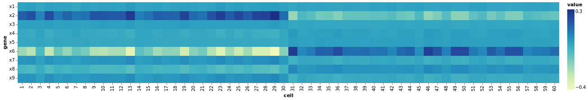
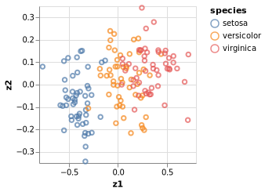

Principal component analysis is a fundamental technique to analyse and visualise data.
You may have come across it in many forms and names.
Here, we give a probabilistic perspective on PCA with some biologically motivated examples.
For more details and a mathematical derivation, we recommend Bishop's textbook (Christopher M. Bishop, Pattern Recognition and Machine Learning, 2006).

```julia
using Turing
using Distributions, LinearAlgebra

# Packages for visualization
using VegaLite, DataFrames, StatsPlots

# Import Fisher's iris example data set
using RDatasets

# Set a seed for reproducibility.
using Random
Random.seed!(1789);
```


## A basic PCA example

The idea of pPCA is to find a latent variable $z$ that can be used to describe
hidden structure in our dataset.
We use a simple Gaussian prior for
$$
P(z) = \mathcal{N}(z | 0, I)
$$
and similarly, the conditional distribution
$$
P(x | z) = \mathcal{N}(x | W z + \mu, \sigma^2 I)
$$
is modeled via a Gaussian distribution.

### Simulate data (a biologically motivated example)

We'll generate synthetic data to explore the models.
The simulation is inspired by biological measurement of
expression of genes in cells, and so you can think of the two dimensions as cells and genes.
While the human genome is (mostly) identical between all the cells in your body, there exist interesting differences in gene expression in different human tissues.
Similarly, one way to investigate certain diseases is to look at differences in gene expression in cells from patients and healthy controls (usually from the same tissue).

Usually, we can assume that the changes in gene expression only affect a subset of all genes (and these can be linked to diseases in some way).
One of the challenges of this kind of data is to see the underlying structure, e.g. to make the connection between a certain state (healthy/disease) and gene expression.
The problem is that the space we are investigating is very large (Up to 20000 genes across 1000s of cells). So in order to find structure in this data, we usually need to project the data into a lower dimensional subspace.

Here, we simulate this problem. Admittedly, this is a very simplistic example with far fewer cells and genes and a very straighforward relationship. We try to capture the essence of the problem, but then, unfortunately, real life problems tend to be much more messy.

If you are not that interested in the biology, the more abstract problem formulation is to project a high-dimensional space onto a different space - in the case of PCA - a space where most of the variation is concentrated in the first few dimensions. So you will use PCA to explore underlying structure in your data that is not necessarily obvious from looking at the raw data itself. Or in mathematical terms, we aim to find the latent variable $z$.

```julia
n_cells = 60
n_genes = 9
mu_1 = 10. * ones(n_genes÷3)
mu_0 = zeros(n_genes÷3)
S = I(n_genes÷3)
mvn_0 = MvNormal(mu_0, S)
mvn_1 = MvNormal(mu_1, S)

# create a diagonal block like expression matrix, with some non-informative genes (remember not all features/genes are informative, some might just not differ very much between cells)
expression_matrix = transpose(vcat(
  hcat(rand(mvn_1, n_cells÷2),
       rand(mvn_0, n_cells÷2)),
  hcat(rand(mvn_0, n_cells÷2),
       rand(mvn_0, n_cells÷2)),
  hcat(rand(mvn_0, n_cells÷2),
       rand(mvn_1, n_cells÷2))))


df_exp = DataFrame(expression_matrix, :auto)
df_exp[!,:cell] = 1:n_cells

DataFrames.stack(df_exp, 1:n_genes) |>
    @vlplot(:rect, x="cell:o", color=:value, encoding={y={field="variable", type="nominal", sort="-x",
    axis={title="gene"}}})
```


Here, you see the simulated data. You can see two groups of cells that differ in the expression of genes. While the difference between the two groups of cells here is fairly obvious from looking at the raw data, in practice and with large enough data sets, it is often impossible to spot the differences from the raw data alone.

### pPCA model
```julia
@model function pPCA(x, ::Type{T} = Float64) where {T}

  # Dimensionality of the problem.
  N, D = size(x)

  # latent variable z
  z = Matrix{T}(undef, D, N)
  for n in 1:N
    z[:, n] ~ MvNormal(D, 1.)
  end

  # weights/loadings W
  w = Matrix{T}(undef, D, D)
  for d in 1:D
    w[d, :] ~ MvNormal(D, 1.)
  end

  # mean offset
  mean ~ MvNormal(D, 1.0)
  mu = w * z .+ mean
  for d in 1:D
    x[:,d] ~ MvNormal(mu[d,:], 1.)
  end

end;
```


### pPCA inference

It is important to note that although the maximum likelihood estimates of W,\mu in the pPCA model correspond to the PCA subspace,
only posterior distributions can be obtained for the latent data (points on the subspace).
Neither the mode nor the mean of those distributions corresponds to the PCA points (orthogonal projections of the observations onto the subspace).
However what is true, is that the posterior distributions converge to the PCA points as \sigma^2 \rightarrow 0. This is relevant when comparing the following results with that obtained from running a non-probabilistic PCA (via maximum-likelihood estimation)

```julia
ppca = pPCA(expression_matrix)
n_iterations = 300
chain = sample(ppca, NUTS(), MCMCThreads(), n_iterations, 1);
```


### pPCA sanity check

A quick sanity check.
We try to reconstruct the input data from our parameter estimates.

```julia
# Extract paramter estimates for plotting - mean of posterior
w = permutedims(reshape(mean(group(chain, :w))[:,2], (n_genes, n_genes)))
z = permutedims(reshape(mean(group(chain, :z))[:,2], (n_genes, n_cells)))'
mu = mean(group(chain, :mean))[:,2]

X = w * z .+ mu
X = w * z

df_rec = DataFrame(X', :auto)
df_rec[!,:cell] = 1:n_cells

DataFrames.stack(df_rec, 1:n_genes) |>
    @vlplot(:rect, x="cell:o", color=:value, encoding={y={field="variable", type="nominal", sort="-x",
    axis={title="gene"}}})
```




We can see the same pattern that we saw in the input data.
This is what we expect, as PCA is essentially a lossless transformation, i.e. the new space contains the same information as the input space as long as we keep all the dimensions.

And finally, we plot the data in a lower dimensional space. The interesting insight here is that we can project the information from the input space into a two-dimensional representation, without lossing the essential information about the two groups of cells in the input data.

```julia
df_pca = DataFrame(z')
rename!(df_pca, Symbol.( ["z"*string(i) for i in collect(1:n_genes)]))
df_pca[!,:cell] = 1:n_cells

DataFrames.stack(df_pca, 1:n_genes) |> @vlplot(:rect, "cell:o", "variable:o", color=:value)

df_pca[!,:type] = repeat([1, 2], inner = n_cells÷2)
df_pca |>  @vlplot(:point, x=:z1, y=:z2, color="type:n")
```

```
Error: ArgumentError: `DataFrame` constructor from a `Matrix` requires pass
ing :auto as a second argument to automatically generate column names: `Dat
aFrame(matrix, :auto)`
```


We can see the two groups are relatively well separated, even though we are only looking at a
two-dimensional subspace.


## Number of components

A common question arising in latent factor models is the choice of components,
i.e. how many dimensions are needed to represent that data in the latent space.
In the case of PCA, there exist a lot of heuristics to make that choice.
By using the pPCA model, this can be accomplished very elegantly, with a technique called *Automatic-Relevance-Determination*.
Essentially, we are using a specific prior over the factor loadings W that allows us to prune away dimensions in the
latent space. The prior is determined by a precision hyperparameter $\alpha$. Here, smaller values of $\alpha$ correspond to more important components.
You can find more details about this in the Bishop book mentioned in the introduction.


```julia
@model function pPCA_ARD(x, ::Type{T} = Float64) where {T}

  # Dimensionality of the problem.
  N, D = size(x)

  # latent variable z
  z = Matrix{T}(undef, D, N)
  for n in 1:N
    z[:, n] ~ MvNormal(D, 1.)
  end

  # weights/loadings w with Automatic Relevance Determination part
  alpha = Vector{T}(undef, D)
  for d in 1:D
    alpha[d] ~ Gamma(1., 1.)
  end

  w = Matrix{T}(undef, D, D)
  for d in 1:D
    w[d, :] ~ MvNormal(zeros(D), 1. ./ sqrt.(alpha))
  end

  mu = w * z

  tau ~ Gamma(1.0, 1.0);
  for d in 1:D
    x[:,d] ~ MvNormal(mu[d,:], 1. / sqrt(tau))
  end

end;
```


```julia
ppca_ARD = pPCA_ARD(expression_matrix)
n_iterations = 400
chain = sample(ppca_ARD, NUTS(), MCMCThreads(), n_iterations, 1)

StatsPlots.plot(group(chain, :alpha))
```


Here we look at the convergence of the chains for the alpha parameter. We can see that the chains have
converged and the posterior of the alpha parameters is centered around much smaller values in two instances. Below, we will use the mean of the small values to select the *relevant* dimensions - we can clearly see based on the values of $\alpha$ that there should be two dimensions in this example.

```julia
# Extract paramter estimates for plotting - mean of posterior
w = permutedims(reshape(mean(group(chain, :w))[:,2], (n_genes,n_genes)))
z = permutedims(reshape(mean(group(chain, :z))[:,2], (n_genes, n_cells)))'
α = mean(group(chain, :alpha))[:,2]
α
```

```
9-element Vector{Float64}:
 3.447150319289705
 0.07532134194323332
 0.07754397424990225
 3.6029909065586874
 3.4102919134808274
 3.4895349964035596
 3.380911472677809
 3.507756238668494
 3.5031739081430793
```


We can inspect alpha to see which elements are small, i.e. have a high relevance.

```julia
alpha_indices = sortperm(α)[1:2]
X = w[alpha_indices, alpha_indices] * z[alpha_indices,:]

df_rec = DataFrame(X', :auto)
df_rec[!,:cell] = 1:n_cells

#  #  DataFrames.stack(df_rec, 1:n_genes) |> @vlplot(:rect, "cell:o", "variable:o", color=:value) |> save("reconstruction.pdf")
DataFrames.stack(df_rec, 1:2) |> @vlplot(:rect, "cell:o", "variable:o", color=:value)

df_pre = DataFrame(z')
rename!(df_pre, Symbol.( ["z"*string(i) for i in collect(1:n_genes)]))
df_pre[!,:cell] = 1:n_cells

DataFrames.stack(df_pre, 1:n_genes) |> @vlplot(:rect, "cell:o", "variable:o", color=:value)

df_pre[!,:type] = repeat([1, 2], inner = n_cells÷2)
df_pre[!,:ard1] = df_pre[:, alpha_indices[1]]
df_pre[!,:ard2] = df_pre[:, alpha_indices[2]]
df_pre |>  @vlplot(:point, x=:ard1, y=:ard2, color="type:n")

This plot is very similar to the low-dimensional plot above, but choosing the *relevant* dimensions based on the values of $\alpha$.
```

```
Error: ArgumentError: `DataFrame` constructor from a `Matrix` requires pass
ing :auto as a second argument to automatically generate column names: `Dat
aFrame(matrix, :auto)`
```


## Batch effects

Finally, a very common issue to address in biological data is [batch effects](https://en.wikipedia.org/wiki/Batch_effec).
A batch effect occurs when non-biological factors in an experiment cause changes in the data produced by the experiment.
As an example, we will look at Fisher's famous Iris data set.

The data set consists of 50 samples each from three species of Iris (Iris setosa, Iris virginica and Iris versicolor).
Four features were measured from each sample: the length and the width of the sepals and petals, in centimeters. [RDatasets.jl](https://github.com/JuliaStats/RDatasets.jl) contains the Iris dataset.

An example for a batch effect in this case might be two different scientists using a different measurement method to determine the length and width of the flowers. This can lead to a systematic bias in the measurement unrelated to the actual experimental variable - the species in this case.

```julia
# Example data set - generate synthetic gene expression data

# dataset available in RDatasets
data = dataset("datasets", "iris")
species = data[!, "Species"]

# we extract the four measured quantities
d = 4
dat = data[!, 1:d]
# and the number of measurements
n = size(dat)[1]
```

```
150
```


First, let's look at the original data using the pPCA model.

```julia
ppca = pPCA(dat)

# Here we use a different samples, we don't always have to use NUTS:
# Hamiltonian Monte Carlo (HMC) sampler parameters
n_iterations = 500
ϵ = 0.05
τ = 10

chain = sample(ppca, HMC(ϵ, τ), n_iterations)

# Extract paramter estimates for plotting - mean of posterior
w = permutedims(reshape(mean(group(chain, :w))[:,2], (d,d)))
z = permutedims(reshape(mean(group(chain, :z))[:,2], (d, n)))'
mu = mean(group(chain, :mean))[:,2]

X = w * z
# X = w * z .+ mu

df_rec = DataFrame(X', :auto)
df_rec[!,:species] = species
DataFrames.stack(df_rec, 1:d) |> @vlplot(:rect, "species:o", "variable:o", color=:value)

df_iris = DataFrame(z', :auto)
rename!(df_iris, Symbol.( ["z"*string(i) for i in collect(1:d)]))
df_iris[!,:sample] = 1:n
df_iris[!,:species] = species

df_iris |>  @vlplot(:point, x=:z1, y=:z2, color="species:n")
```




We can see that the setosa species is more clearly separated from the other two species, who overlap
considerably.

We now simulate a batch effect; imagine the person taking the measurement uses two different rulers and they are slightly off.
Again, in practice there are many different reasons for why batch effects occur and it is not always clear what is really at the basis of them,
nor can they always be tackled via the experimental setup. So we need methods to deal with them.

```julia
## Introduce batch effect
batch = rand(Binomial(1, 0.5), 150)
effect = rand(Normal(2.4, 0.6), 150)
batch_dat = dat .+ batch .* effect

ppca_batch = pPCA(batch_dat)
chain = sample(ppca_batch, HMC(ϵ, τ), 500)
describe(chain)[1]

z = permutedims(reshape(mean(group(chain, :z))[:,2], (d, n)))'
df_pre = DataFrame(z')
rename!(df_pre, Symbol.( ["z"*string(i) for i in collect(1:d)]))
df_pre[!,:sample] = 1:n
df_pre[!,:species] = species
df_pre[!,:batch] = batch

df_pre |>  @vlplot(:point, x=:z1, y=:z2, color="species:n", shape=:batch)
```

```
Error: ArgumentError: `DataFrame` constructor from a `Matrix` requires pass
ing :auto as a second argument to automatically generate column names: `Dat
aFrame(matrix, :auto)`
```


The batch effect makes it much harder to distinguish the species. And importantly, if we are not aware of the
batches, this might lead us to make wrong conclusions about the data.

In order to correct for the batch effect, we need to know about the assignment of measurement to batch.
In our example, this means knowing which ruler was used for which measurement.

```julia
@model function pPCA_residual(x, batch, ::Type{T} = Float64) where {T}

  # Dimensionality of the problem.
  N, D = size(x)

  # latent variable z
  z = Matrix{T}(undef, D, N)
  for n in 1:N
    z[:, n] ~ MvNormal(D, 1.)
  end

  # weights/loadings w
  w = Matrix{T}(undef, D, D)
  for d in 1:D
    w[d, :] ~ MvNormal(D, 1.)
  end

  # covariate vector
  w_batch = Vector{T}(undef, D)
  w_batch ~ MvNormal(D, 1.)

  # mean offset
  mean = Vector{T}(undef, D)
  mean ~ MvNormal(D, 1.0)
  mu = w * z .+ mean + w_batch .* batch'

  for d in 1:D
    x[:,d] ~ MvNormal(mu[d,:], 1.)
  end

end;

ppca_residual = pPCA_residual(batch_dat, convert(Vector{Float64}, batch))
chain = sample(ppca_residual, HMC(ϵ, τ), 1000);
```


This model is described in considerably more detail [here](https://arxiv.org/abs/1106.4333).

```julia

z = permutedims(reshape(mean(group(chain, :z))[:,2], (d, n)))'
df_post = DataFrame(z')
rename!(df_post, Symbol.( ["z"*string(i) for i in collect(1:d)]))
df_post[!,:sample] = 1:n
df_post[!,:species] = species
df_post[!,:batch] = batch

df_post |>  @vlplot(:point, x=:z1, y=:z2, color="species:n", shape=:batch)
```

```
Error: ArgumentError: `DataFrame` constructor from a `Matrix` requires pass
ing :auto as a second argument to automatically generate column names: `Dat
aFrame(matrix, :auto)`
```


We can now see, that the data are better separated in the latent space by accounting for the batch effect. It is not perfect, but definitely an improvement over the previous plot.


## Appendix
 This tutorial is part of the TuringTutorials repository, found at: <https://github.com/TuringLang/TuringTutorials>.

To locally run this tutorial, do the following commands:
```julia, eval = false
using TuringTutorials
TuringTutorials.weave_file("11-probabilistic-pca", "11-probabilistic-pca.jmd")
```

Computer Information:
```
Julia Version 1.6.1
Commit 6aaedecc44 (2021-04-23 05:59 UTC)
Platform Info:
  OS: Linux (x86_64-pc-linux-gnu)
  CPU: Intel(R) Core(TM) i7-8550U CPU @ 1.80GHz
  WORD_SIZE: 64
  LIBM: libopenlibm
  LLVM: libLLVM-11.0.1 (ORCJIT, skylake)
Environment:
  JULIA_NUM_THREADS = 8

```

Package Information:

```
      Status `~/TuringDev/TuringTutorials/tutorials/11-probabilistic-pca/Project.toml`
  [a93c6f00] DataFrames v1.2.0
  [31c24e10] Distributions v0.25.9
  [ce6b1742] RDatasets v0.7.5
  [f3b207a7] StatsPlots v0.14.24
  [fce5fe82] Turing v0.16.5
  [112f6efa] VegaLite v2.6.0
  [37e2e46d] LinearAlgebra

```
